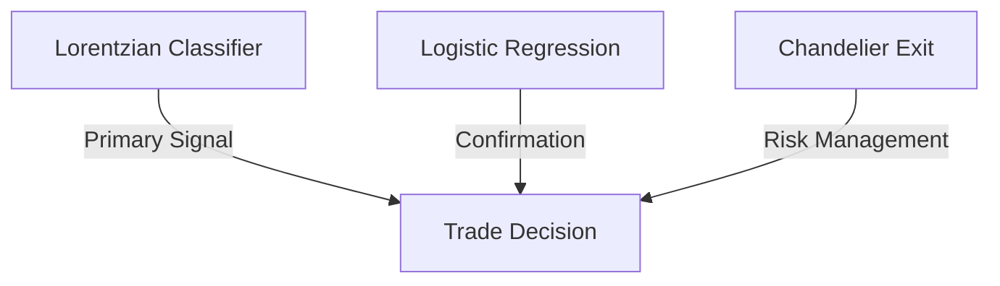

# 🔬 Technical Trading Strategy Implementation

## Table of Contents
1. [Strategy Overview](#strategy-overview)
2. [Core Components](#core-components)
3. [Technical Indicators](#technical-indicators)
4. [Signal Generation](#signal-generation)
5. [Position Management](#position-management)
6. [Implementation Details](#implementation-details)

## Strategy Overview

This strategy combines machine learning with traditional technical analysis to create a robust trading system. The core components work in harmony to identify, validate, and execute trades.

### Signal Hierarchy


## Core Components

### 1. Lorentzian Classification
Primary signal generator using K-Nearest Neighbors with Lorentzian distance metric.

```python
def lorentzian_distance(x1, x2):
    return np.log(1 + np.abs(x1 - x2))

def calculate_lorentzian_score(data_window, neighbors=8):
    distances = np.array([
        lorentzian_distance(data_window[-1], x) 
        for x in data_window[:-1]
    ])
    return np.mean(np.sort(distances)[:neighbors])
```

#### Feature Set
```python
features = {
    'rsi_14_1': {'length': 14, 'smooth': 1},
    'wavetrend': {'channel_length': 10, 'avg_length': 11},
    'cci_20_1': {'length': 20, 'smooth': 1},
    'adx_20_2': {'length': 20, 'smooth': 2},
    'rsi_9_1': {'length': 9, 'smooth': 1}
}
```

### 2. Logistic Regression
Probability-based signal confirmation using enhanced feature set.

```python
class LogisticConfirmation:
    def __init__(self, threshold=0.7):
        self.threshold = threshold
        self.model = LogisticRegression(
            C=1.0,
            class_weight='balanced',
            max_iter=1000
        )
    
    def confirm_signal(self, features, signal):
        prob = self.model.predict_proba(features)[0]
        return (prob > self.threshold and signal > 0) or \
               (prob < (1-self.threshold) and signal < 0)
```

### 3. Chandelier Exit
ATR-based trailing stop system for position management.

```python
def calculate_chandelier_exit(high, low, close, atr_period=22, multiplier=3.0):
    atr = calculate_atr(high, low, close, atr_period)
    
    long_stop = high - (multiplier * atr)
    short_stop = low + (multiplier * atr)
    
    return long_stop, short_stop
```

## Technical Indicators

### 1. Wave Trend
```python
def calculate_wave_trend(close, channel_length=10, avg_length=11):
    esa = ema(close, channel_length)
    d = ema(abs(close - esa), channel_length)
    ci = (close - esa) / (0.015 * d)
    wt1 = ema(ci, avg_length)
    wt2 = sma(wt1, 4)
    
    return wt1, wt2
```

### 2. Enhanced RSI
```python
def calculate_enhanced_rsi(close, length=14, smooth=1):
    rsi = talib.RSI(close, timeperiod=length)
    if smooth > 1:
        rsi = talib.EMA(rsi, timeperiod=smooth)
    return rsi
```

### 3. Custom CCI
```python
def calculate_custom_cci(high, low, close, length=20, smooth=1):
    typical_price = (high + low + close) / 3
    sma_tp = talib.SMA(typical_price, timeperiod=length)
    mean_deviation = mean_dev(typical_price, length)
    cci = (typical_price - sma_tp) / (0.015 * mean_deviation)
    
    if smooth > 1:
        cci = talib.EMA(cci, timeperiod=smooth)
    return cci
```

## Signal Generation

### Feature Calculation
```python
def calculate_features(ohlcv_data):
    features = {}
    
    # Price action features
    features['close_change'] = np.diff(ohlcv_data['close'])
    features['volume_change'] = np.diff(ohlcv_data['volume'])
    
    # Technical indicators
    features['wt1'], features['wt2'] = calculate_wave_trend(
        ohlcv_data['close']
    )
    features['rsi'] = calculate_enhanced_rsi(
        ohlcv_data['close']
    )
    features['cci'] = calculate_custom_cci(
        ohlcv_data['high'],
        ohlcv_data['low'],
        ohlcv_data['close']
    )
    
    return features
```

### Signal Combination
```python
def generate_signal(features, lorentzian_signal, logistic_prob):
    """
    Combine signals from different components
    
    Returns:
        1: Long signal
        -1: Short signal
        0: No trade
    """
    if lorentzian_signal > 0 and logistic_prob > 0.7:
        return 1
    elif lorentzian_signal < 0 and logistic_prob < 0.3:
        return -1
    return 0
```

## Position Management

### Entry Rules
```python
def validate_entry(signal, current_price, volatility):
    min_volatility = calculate_min_volatility()
    max_volatility = calculate_max_volatility()
    
    volatility_valid = min_volatility <= volatility <= max_volatility
    
    return signal != 0 and volatility_valid
```

### Position Sizing
```python
def calculate_position_size(
    account_balance,
    risk_per_trade=0.02,  # 2% risk per trade
    stop_distance=None
):
    if stop_distance is None:
        stop_distance = calculate_atr(20) * 3
    
    max_loss = account_balance * risk_per_trade
    position_size = max_loss / stop_distance
    
    return position_size
```

### Stop Loss Management
```python
def update_stops(
    position,
    current_price,
    long_stop,
    short_stop
):
    if position > 0:  # Long position
        return long_stop
    elif position < 0:  # Short position
        return short_stop
    return None
```

## Implementation Details

### Data Pipeline
```python
class TradingPipeline:
    def __init__(self, config):
        self.features = FeatureCalculator(config)
        self.signals = SignalGenerator(config)
        self.risk = RiskManager(config)
        
    def process_data(self, ohlcv):
        # Calculate features
        features = self.features.calculate(ohlcv)
        
        # Generate signals
        signals = self.signals.generate(features)
        
        # Manage risk
        position = self.risk.manage_position(
            signals,
            features
        )
        
        return position
```

### Model Training
```python
def train_models(X_train, y_train, config):
    # Train Lorentzian Classifier
    lorentzian = LorentzianClassifier(
        n_neighbors=config.n_neighbors,
        chronological_split=True
    )
    lorentzian.fit(X_train, y_train)
    
    # Train Logistic Confirmation
    logistic = LogisticConfirmation(
        threshold=config.threshold
    )
    logistic.fit(X_train, y_train)
    
    return lorentzian, logistic
```

### Performance Monitoring
```python
class PerformanceMonitor:
    def __init__(self):
        self.trades = []
        self.metrics = {}
    
    def log_trade(self, trade):
        self.trades.append(trade)
        self.update_metrics()
    
    def update_metrics(self):
        self.metrics['win_rate'] = self.calculate_win_rate()
        self.metrics['profit_factor'] = self.calculate_profit_factor()
        self.metrics['sharpe_ratio'] = self.calculate_sharpe_ratio()
```

## Configuration

### Example config.yaml
```yaml
model:
  lorentzian:
    n_neighbors: 8
    chronological_split: true
    feature_set:
      - rsi_14_1
      - wavetrend
      - cci_20_1
      - adx_20_2
      - rsi_9_1

  logistic:
    threshold: 0.7
    class_weight: balanced
    max_iter: 1000

risk:
  max_position_size: 0.1  # 10% of account
  risk_per_trade: 0.02   # 2% risk per trade
  max_leverage: 20
```

---

*This document provides the technical implementation details of our trading strategy. It serves as a reference for development and maintenance of the trading system.* 