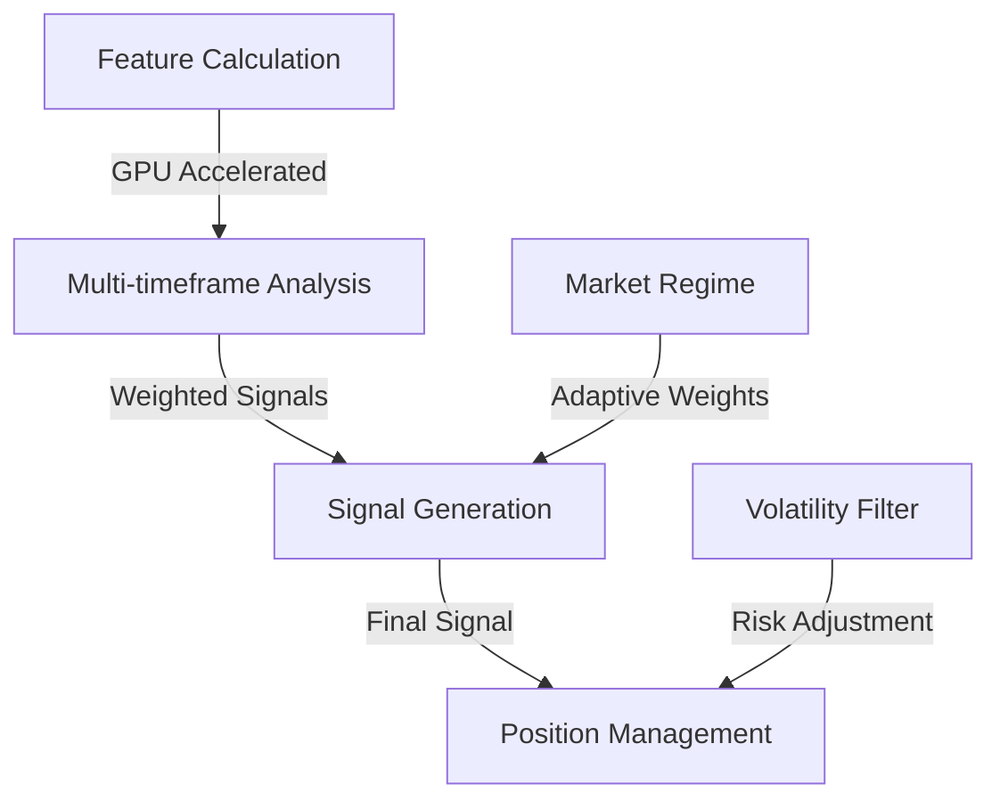

# 🔬 Technical Trading Strategy Implementation

## Table of Contents
1. [Strategy Overview](#strategy-overview)
2. [Core Components](#core-components)
3. [Technical Indicators](#technical-indicators)
4. [Signal Generation](#signal-generation)
5. [Position Management](#position-management)
6. [Implementation Details](#implementation-details)

## Strategy Overview

This strategy combines machine learning with traditional technical analysis to create a robust trading system. The core components work in harmony to identify, validate, and execute trades.

### Signal Generation Flow


## Core Components

### 1. Feature Engineering
GPU-accelerated technical indicators in the `features/` directory:

```python
class FeatureIndicator:
    def __init__(self, **params):
        self.device = torch.device("cuda" if torch.cuda.is_available() else "cpu")
        
    def forward(self, *inputs):
        # GPU-accelerated calculations
        pass
```

#### Indicator Suite
- RSI with customizable smoothing
- WaveTrend with adaptive channel length
- CCI with volatility scaling
- ADX for trend strength measurement

### 2. Multi-timeframe Analysis
```python
def generate_signals(self, x: torch.Tensor) -> torch.Tensor:
    # Get predictions from forward pass
    scores = self.forward(x)
    
    # Initialize timeframe weights
    weights = {
        "short": 0.4,    # 5-period window
        "medium": 0.35,  # 10-period window
        "long": 0.25     # 20-period window
    }
    
    # Calculate weighted signals
    final_votes = (
        weights["short"] * short_votes +
        weights["medium"] * medium_votes +
        weights["long"] * long_votes
    )
    
    return signals
```

### 3. Adaptive Signal Generation
Signal thresholds that adapt to market conditions:

```python
def calculate_adaptive_threshold(volatility: torch.Tensor) -> torch.Tensor:
    base_threshold = 0.10
    volatility_scale = torch.clamp(volatility / volatility.mean(), 0.5, 2.0)
    return base_threshold * volatility_scale
```

## Technical Indicators

### 1. Enhanced RSI
```python
class RSIFeature:
    def forward(self, close: torch.Tensor) -> torch.Tensor:
        # Calculate price changes
        delta = close[1:] - close[:-1]
        
        # Separate gains and losses
        gains = torch.where(delta > 0, delta, torch.zeros_like(delta))
        losses = torch.where(delta < 0, -delta, torch.zeros_like(delta))
        
        # Calculate smoothed averages
        avg_gain = self.smooth(gains)
        avg_loss = self.smooth(losses)
        
        # Calculate RSI
        rs = avg_gain / (avg_loss + 1e-6)
        rsi = 100 - (100 / (1 + rs))
        
        return rsi
```

### 2. WaveTrend with Volatility
```python
class WaveTrendFeature:
    def forward(
        self, 
        high: torch.Tensor, 
        low: torch.Tensor, 
        close: torch.Tensor
    ) -> torch.Tensor:
        # Calculate typical price
        tp = (high + low + close) / 3
        
        # Estimate volatility
        volatility = self.calculate_volatility(high, low)
        
        # Adjust channel length based on volatility
        ap = self.ema(tp, self.channel_length * volatility)
        
        # Calculate oscillator
        ci = (tp - ap) / (0.015 * self.calculate_meandev(tp, ap))
        
        return self.ema(ci, self.avg_length)
```

## Signal Generation

### Feature Combination
```python
def combine_features(self, features: Dict[str, torch.Tensor]) -> torch.Tensor:
    # Normalize features
    normalized = {
        name: (f - f.mean()) / (f.std() + 1e-6)
        for name, f in features.items()
    }
    
    # Combine with learned weights
    combined = sum(
        self.feature_weights[name] * feat 
        for name, feat in normalized.items()
    )
    
    return combined
```

### Regime Detection
```python
def detect_market_regime(
    self, 
    volatility: torch.Tensor,
    trend: torch.Tensor
) -> torch.Tensor:
    # Classify market regime
    is_trending = torch.abs(trend) > self.trend_threshold
    is_volatile = volatility > self.volatility_threshold
    
    # Adjust weights based on regime
    if is_trending and not is_volatile:
        return "trend"
    elif is_volatile:
        return "volatile"
    else:
        return "range"
```

## Position Management

### Dynamic Position Sizing
```python
def calculate_position_size(
    self,
    signal: float,
    volatility: float,
    balance: float
) -> float:
    # Base risk percentage
    risk_pct = 0.02  # 2% base risk
    
    # Adjust for volatility
    vol_scale = min(max(1.0, volatility / self.avg_volatility), 2.0)
    adjusted_risk = risk_pct / vol_scale
    
    # Calculate position size
    price = self.get_current_price()
    stop_distance = self.calculate_stop_distance(volatility)
    
    return (balance * adjusted_risk) / stop_distance
```

### Risk Management
```python
def manage_risk(
    self,
    position: float,
    current_price: float,
    volatility: float
) -> Tuple[float, float]:
    # Calculate adaptive stops
    atr = volatility * self.stop_multiplier
    
    if position > 0:  # Long position
        stop_loss = current_price - atr
        take_profit = current_price + (atr * self.reward_ratio)
    else:  # Short position
        stop_loss = current_price + atr
        take_profit = current_price - (atr * self.reward_ratio)
    
    return stop_loss, take_profit
```

## Implementation Details

### GPU Optimization
```python
def optimize_calculations(self):
    # Move data to GPU
    self.data = {
        k: torch.tensor(v, device=self.device)
        for k, v in self.data.items()
    }
    
    # Batch process features
    with torch.cuda.amp.autocast():
        features = self.calculate_features(self.data)
        signals = self.generate_signals(features)
    
    return signals.cpu().numpy()
```

### Performance Monitoring
```python
def monitor_performance(self):
    metrics = {
        'win_rate': self.calculate_win_rate(),
        'profit_factor': self.calculate_profit_factor(),
        'sharpe_ratio': self.calculate_sharpe_ratio(),
        'max_drawdown': self.calculate_max_drawdown()
    }
    
    # Log metrics
    self.logger.info(f"Performance Metrics: {metrics}")
    
    return metrics
```

## Configuration

### Example config.yaml
```