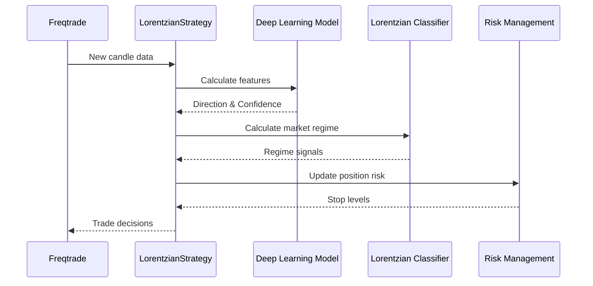

# 🔄 Freqtrade Integration Guide

## Component Integration

### 1. PyTorch Model Integration
```python
# In lorentzian_strategy.py
def populate_indicators(self, dataframe: DataFrame, metadata: dict) -> DataFrame:
    # 1. Prepare features
    features = self.prepare_features(dataframe)
    
    # 2. Get model predictions
    predictions = self.model.predict_batch(features)
    
    # 3. Add predictions to dataframe
    dataframe['dl_direction'] = predictions['direction']
    dataframe['dl_confidence'] = predictions['confidence']
    
    return dataframe
```

### 2. Lorentzian Classifier Integration
```python
# In indicators/lorentzian.py
@dataclass
class LorentzianSignal:
    def calculate(self, dataframe: DataFrame) -> Series:
        # Your existing Lorentzian calculation
        distances = self.lorentzian_distance(dataframe)
        scores = self.knn_score(distances)
        return scores

# In lorentzian_strategy.py
def populate_indicators(self, dataframe: DataFrame, metadata: dict) -> DataFrame:
    # Add Lorentzian signals
    dataframe['lorentzian_signal'] = self.lorentzian.calculate(dataframe)
```

### 3. Custom Indicators Integration
```python
# Each indicator is implemented as a custom class
class WaveTrendIndicator(CustomIndicator):
    def populate_indicators(self, dataframe: DataFrame) -> DataFrame:
        # Your WaveTrend implementation
        return dataframe

class EnhancedRSI(CustomIndicator):
    def populate_indicators(self, dataframe: DataFrame) -> DataFrame:
        # Your Enhanced RSI implementation
        return dataframe
```

### 4. Risk Management Integration
```python
# In risk_management/chandelier_exit.py
class ChandelierExit:
    def calculate_stops(self, dataframe: DataFrame) -> Tuple[Series, Series]:
        # Your Chandelier Exit implementation
        return long_stops, short_stops

# In lorentzian_strategy.py
def custom_stoploss(self, pair: str, trade: Trade, current_time: datetime,
                   current_rate: float, current_profit: float, **kwargs) -> float:
    # Implement dynamic stops using Chandelier Exit
    return self.chandelier.get_stop(pair, trade.is_short)
```

## Data Flow



## FreqAI Integration

The strategy uses FreqAI's capabilities for:
1. Model persistence
2. Feature preprocessing
3. Prediction handling
4. Model retraining

```python
class LorentzianStrategy(IStrategy, IFreqAI):
    def feature_engineering_standard(self, dataframe: DataFrame, **kwargs) -> DataFrame:
        # Feature engineering for the model
        return self.prepare_features(dataframe)

    def set_freqai_targets(self, dataframe: DataFrame, **kwargs) -> DataFrame:
        # Set prediction targets
        return self.prepare_targets(dataframe)
```

## Custom Components

### 1. Feature Pipeline
- Standardization
- Sequence creation
- Technical indicator calculation

### 2. Model Manager
- Model loading/saving
- Batch prediction
- GPU utilization

### 3. Signal Combiner
- Weighted signal combination
- Confidence thresholding
- Timeframe alignment

## Configuration Integration

```json
{
    "freqai": {
        "enabled": true,
        "feature_parameters": {
            "include_timeframes": [
                "5m",
                "15m",
                "1h"
            ],
            "include_corr_pairlist": [
                "BTC/USDT",
                "ETH/USDT"
            ],
            "label_period_candles": 24,
            "include_shifted_candles": 2,
            "DI_threshold": 0.9,
            "weight_factor": 0.9
        },
        "data_split_parameters": {
            "train_period_days": 30,
            "startup_candles": 100,
            "test_period_days": 10
        },
        "model_training_parameters": {
            "learning_rate": 0.001,
            "epochs": 50,
            "batch_size": 32
        }
    }
}
```

## Important Notes

1. **Model Initialization**
   - Models are loaded in `__init__`
   - GPU detection and allocation
   - Batch size optimization

2. **Performance Considerations**
   - Caching of technical indicators
   - Efficient numpy operations
   - Proper cleanup in `bot_cleanup`

3. **Error Handling**
   - Graceful fallback for model errors
   - State persistence
   - Exception logging

4. **Monitoring**
   - TensorBoard integration
   - Custom metric logging
   - Performance tracking 