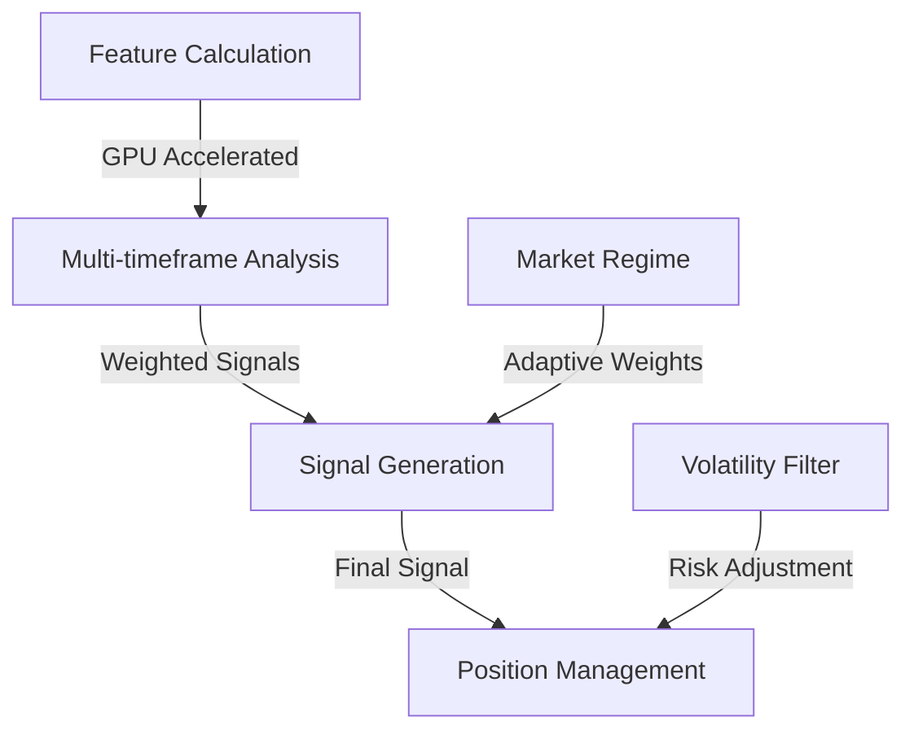

# 🚀 GPU-Accelerated ML Trading System

## 📋 Table of Contents
1. [Overview](#overview)
2. [Core Components](#core-components)
3. [Signal Generation Flow](#signal-generation-flow)
4. [Technical Features](#technical-features)
5. [Trading Strategy](#trading-strategy)
6. [Configuration](#configuration)
7. [Performance Metrics](#performance-metrics)
8. [Usage](#usage)
9. [Files](#files)
10. [Future Enhancements](#future-enhancements)

## 📚 Related Documentation
- [System Architecture](../../docs/DOCUMENTATION.md)
- [Performance Tuning](../../docs/PERFORMANCE_TUNING.md)
- [Feature Development](../../docs/FEATURE_DEVELOPMENT.md)
- [Security Guidelines](../../docs/SECURITY.md)

## 🔍 Overview

This system combines GPU-accelerated technical analysis with multi-timeframe machine learning to create a robust trading strategy. The system is designed for high performance and adaptability to different market conditions.

![System Overview]
```
[Insert system_overview.png here]
Recommended dimensions: 1200x600px
Description: High-level overview of the trading system architecture
```

## 🧩 Core Components

### 1. GPU-Accelerated Feature Engineering
- Modular technical indicators implemented in PyTorch
- Efficient batch processing on GPU
- Real-time feature calculation
- Adaptive parameter adjustment

![Feature Engineering Pipeline]
```
[Insert feature_engineering.png here]
Recommended dimensions: 1000x500px
Description: Diagram showing the feature engineering pipeline
```

### 2. Multi-timeframe Analysis
- Short-term (5-period): 40% weight
- Medium-term (10-period): 35% weight
- Long-term (20-period): 25% weight
- Dynamic regime-based weight adjustment

![Timeframe Analysis]
```
[Insert timeframe_analysis.png here]
Recommended dimensions: 800x400px
Description: Visualization of multi-timeframe analysis
```

### 3. Adaptive Position Management
- Volatility-based position sizing
- Dynamic stop-loss calculation
- Market regime-aware risk adjustment
- Profit target optimization

![Position Management]
```
[Insert position_management.png here]
Recommended dimensions: 900x500px
Description: Position management workflow diagram
```

## 📊 Signal Generation Flow

The system follows this signal generation hierarchy:



A trade is executed when:
1. Feature calculations indicate a potential opportunity
2. Multi-timeframe analysis confirms the signal
3. Market regime and volatility conditions are favorable
4. Position sizing and risk parameters are satisfied

## 🛠️ Technical Features

- **GPU Acceleration**: All components optimized for GPU processing
- **Adaptive Learning**: Dynamic parameter adjustment based on market conditions
- **Risk Management**: Sophisticated position sizing and stop-loss system
- **Performance Monitoring**: Comprehensive metrics and visualization
- **Modular Design**: Easy to extend with new features and indicators

![Technical Architecture]
```
[Insert technical_architecture.png here]
Recommended dimensions: 1100x700px
Description: Detailed technical architecture diagram
```

## 📈 Trading Strategy

### Entry Criteria
- Signal strength exceeds adaptive threshold
- Multi-timeframe consensus achieved
- Market regime is favorable
- Volatility is within acceptable range

### Exit Criteria
- Adaptive stop-loss hit
- Take profit target reached
- Multi-timeframe signal reversal
- Regime change detected

### Risk Management
- Dynamic position sizing based on:
  - Market volatility
  - Account risk parameters
  - Market regime
  - Signal strength

![Trading Strategy Flow]
```
[Insert trading_strategy.png here]
Recommended dimensions: 1000x600px
Description: Trading strategy decision flow diagram
```

## 🔧 Configuration

Three primary configuration profiles:
- `default_config`: Balanced approach
- `aggressive_config`: Higher volatility tolerance
- `conservative_config`: Enhanced risk management

For detailed configuration options, see [CONFIGURATION.md](../../docs/CONFIGURATION.md).

## 📊 Performance Metrics

The system tracks:
- Win rate and profit factor
- Risk-adjusted returns
- Maximum drawdown
- Volatility metrics
- Regime-specific performance

![Performance Dashboard]
```
[Insert performance_dashboard.png here]
Recommended dimensions: 1200x800px
Description: Real-time performance monitoring dashboard
```

## 📖 Usage

```python
from strategies.LorentzianStrategy.models.primary.lorentzian_classifier import LorentzianClassifier
from strategies.LorentzianStrategy.features import RSIFeature, WaveTrendFeature

# Initialize features
rsi = RSIFeature(period=14)
wave_trend = WaveTrendFeature(channel_length=10)

# Initialize classifier
classifier = LorentzianClassifier()

# Process data
features = {
    'rsi': rsi.forward(close_prices),
    'wave_trend': wave_trend.forward(high_prices, low_prices, close_prices)
}

# Generate signals
signals = classifier.generate_signals(features)
```

For more examples, see [EXAMPLES.md](../../docs/EXAMPLES.md).

## 📦 Files

- `models/primary/lorentzian_classifier.py`: Main classifier implementation
- `features/*.py`: GPU-accelerated technical indicators
- `test_model_comparison.py`: Performance comparison framework
- `config.py`: Configuration and hyperparameters

For detailed file documentation, see [STRUCTURE.md](./STRUCTURE.md).

## 🔍 Future Enhancements

- [ ] Advanced regime detection
- [ ] Additional technical indicators
- [ ] Enhanced GPU optimization
- [ ] Automated parameter tuning
- [ ] Real-time performance analytics

For planned features and improvements, see [ROADMAP.md](../../docs/ROADMAP.md).

---

## 📚 Additional Resources
- [Contributing Guide](../../docs/CONTRIBUTING.md)
- [Performance Tuning](../../docs/PERFORMANCE_TUNING.md)
- [Security Guidelines](../../docs/SECURITY.md)
- [Troubleshooting Guide](../../docs/TROUBLESHOOTING.md)

## ⚠️ Disclaimer

*This trading system is for educational purposes only. Always conduct your own research and risk assessment before trading.*

[Back to Documentation Hub](../../docs/DOCUMENTATION.md) 