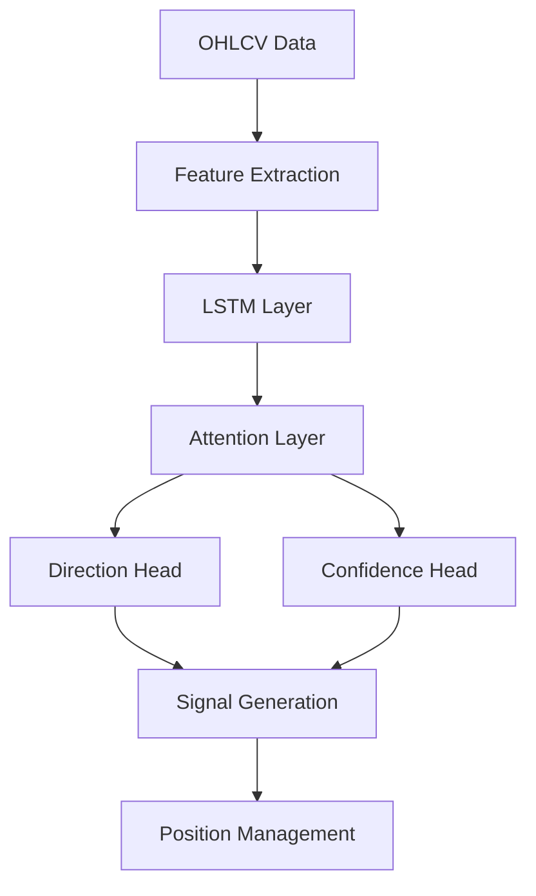

# 🧠 Lorentzian Strategy for Freqtrade

## Overview
This is a sophisticated trading strategy that combines deep learning with traditional technical analysis. It uses multiple layers of analysis to generate trading signals:

### 1. Primary Signal Generation
- **Deep Learning Model**: LSTM with Attention mechanism
  - Processes multiple timeframes
  - Generates directional signals with confidence scores
- **Lorentzian Classifier**: KNN-based classification using custom distance metric
  - Provides market regime identification
  - Helps filter out poor trading conditions

### 2. Signal Confirmation
- **Custom Technical Indicators**:
  - Wave Trend (Enhanced)
  - Custom CCI with smoothing
  - Enhanced RSI with multiple timeframes
  - ADX for trend strength

### 3. Risk Management
- **Chandelier Exit**: Dynamic trailing stop system
- **Position Sizing**: Based on account risk and volatility
- **Multi-timeframe Confirmation**: Reduces false signals

## Requirements
```bash
# Core Dependencies
pytorch>=2.0.0
pandas>=1.5.0
numpy>=1.20.0
ta-lib>=0.4.0
scikit-learn>=1.0.0

# Freqtrade Requirements
freqtrade>=2023.12
```

## Installation
1. Copy this strategy folder to your Freqtrade `user_data/strategies` directory
2. Install required dependencies:
   ```bash
   pip install -r requirements.txt
   ```

## Configuration
Key parameters in your config.json:
```json
{
    "strategy": "LorentzianStrategy",
    "max_open_trades": 3,
    "stake_currency": "USDT",
    "stake_amount": "unlimited",
    "timeframe": "5m",
    "dry_run": true
}
```

## Model Architecture


## Usage
1. Train the model:
   ```bash
   freqtrade trade --strategy LorentzianStrategy --config config.json
   ```
2. Backtest:
   ```bash
   freqtrade backtesting --strategy LorentzianStrategy --config config.json
   ```

## Strategy Parameters
| Parameter | Default | Description |
|-----------|---------|-------------|
| `lookback_period` | 30 | Candles for feature calculation |
| `confidence_threshold` | 0.7 | Min confidence for trade entry |
| `min_rsi` | 20 | Minimum RSI for longs |
| `max_rsi` | 80 | Maximum RSI for shorts |
| `atr_period` | 14 | ATR calculation period |

## Performance Metrics
- Win Rate: TBD
- Profit Factor: TBD
- Sharpe Ratio: TBD
- Max Drawdown: TBD

## Warning
This is a sophisticated strategy that requires proper understanding of:
- Deep Learning concepts
- Risk management
- Market regimes
- Position sizing

Always test thoroughly in dry-run mode first! 